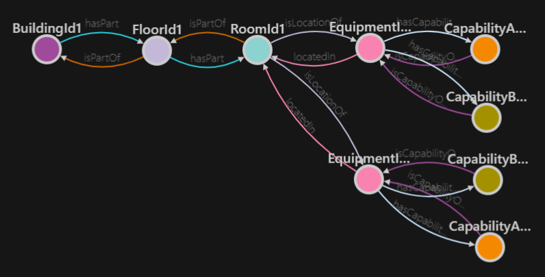

# このリポジトリについて
Azure IoT Hub の環境をサクッと構築するためのコードです。デプロイを行うことで、以下のことを行います。

- リソースグループの作成
- Azure Digital Twin Instance の作成
- Azure Digital Twin Instance へのモデル、ツイン、リレーションの登録

# 登録されるツイン
以下のツインが```GenerateTwinComponents```フォルダ配下の.NETアプリケーションを使って登録されます。


# 使用するのに必要なもの
- [.NET 6 Runtime](https://dotnet.microsoft.com/en-us/download/dotnet/6.0)
- [Azure CLI](https://docs.microsoft.com/ja-jp/cli/azure/install-azure-cli)
- [Azure Bicep](https://docs.microsoft.com/ja-jp/azure/azure-resource-manager/bicep/install)

# デプロイ
以下のコマンドを実行して、環境をデプロイしてください。Azureリソースが作成され、サンプルのモデル、ツイン、リレーションを作成した Digital Twin インスタンスに登録されます。

```sh
deploy.sh [リソースグループ名]
# deploy.sh rg-adt-sample
```

[Azure Digital Twins Explorer](https://explorer.digitaltwins.azure.net/) へアクセスして、登録されたツイン等を確認します。
